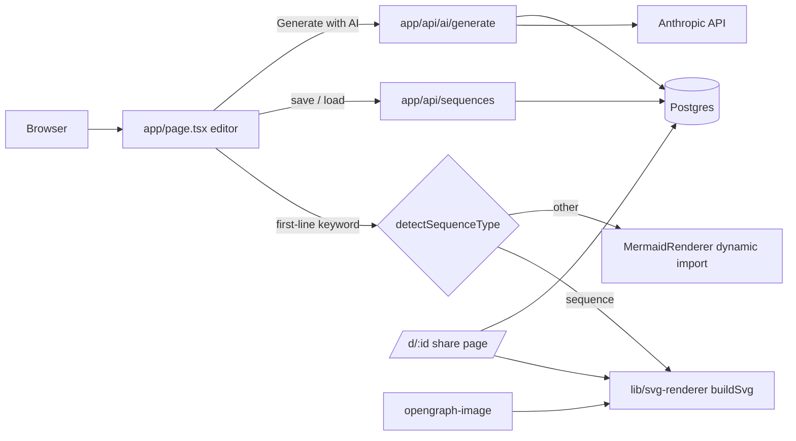
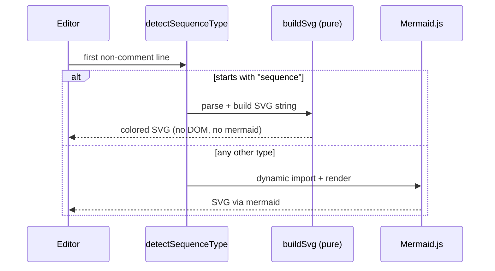

<div align="center">
  
  <h1>Sequences</h1>
  <p><em>Natural-language to Mermaid diagrams, generated by Claude</em></p>
  <p><a href="https://sequences-bheng.vercel.app">Live</a> &middot; <a href="https://github.com/bunlongheng/sequences">Repo</a> &middot; <a href="https://bunlongheng.com/projects?name=sequences">Portfolio</a></p>
  
</div>

---

# Sequences

Describe a flow in plain English and Claude turns it into a rendered diagram, or paste Mermaid syntax directly. Sequence diagrams render through a hand-built colorful SVG engine; ~30 other Mermaid types render via Mermaid.js. Save, tag, share, and export - all from one canvas.


[](LICENSE)


## Contents

- [Features](#features)
- [Architecture](#architecture)
- [How a diagram is rendered](#how-a-diagram-is-rendered)
- [Tech stack](#tech-stack)
- [Quick start](#quick-start)
- [Configuration](#configuration)
- [Project layout](#project-layout)
- [License](#license)

## Features

- **AI generation** - describe a flow in English; Claude (`@anthropic-ai/sdk`) returns Mermaid, which auto-saves with a token count.
- **Two render engines** - a custom pure-SVG renderer for `sequenceDiagram` (colored lifelines, numbered steps, pill labels, notes), and Mermaid.js for ~30 other types (flowchart, class, ER, state, gantt, pie, mindmap, timeline, gitGraph, C4, sankey, and more).
- **Figma-style canvas** - wheel pan, pinch/Ctrl zoom-to-cursor, drag pan, fit-to-view, and keyboard shortcuts (Cmd+S save, Cmd+0/F fit, Cmd+/- zoom, 50-deep undo).
- **Live editor** - `react-simple-code-editor` with a custom Prism grammar, resizable panel, 1.5s debounced autosave.
- **Themes** - light, dark, and monokai for both the diagram and the editor chrome, over a fixed 12-color palette.
- **Persistence** - sequences saved to Postgres with slugs, tags, per-sequence settings (JSONB), and a public flag.
- **Sharing** - `/d/[id]` share pages with a server-rasterized 1200x630 OG image, raw `/svg/[id]` download, QR codes, and a native Web Share hook.
- **Automation API** - `POST /api/ai/sequences` (Bearer-secret) lets external agents create sequence diagrams and get back an SVG URL, with self-describing 400 responses.
- **Presenter mode** - fullscreen view with a hold-click spotlight and click-to-highlight, auto-enabled for non-owners.
- **Export** - 2x-retina PNG, raw SVG, Mermaid source, and parsed-model JSON.

## Architecture

A single-owner Next.js App Router app. The interactive editor is a client island; API routes are thin (auth gate then a parameterized `pg` query then JSON). The heart of the app is `lib/svg-renderer.ts` - a pure, DOM-free renderer used verbatim on both the client (live editor) and the server (share page, SVG download, OG image), so sequence rendering has one source of truth.



| Layer | Role |
|-------|------|
| `app/page.tsx` | Server router: SSR index vs. the client editor |
| `app/SequenceEditor.tsx` | The diagram editor (client) |
| `app/SequencesShell.tsx` -> `SequencesClient.tsx` | Auth gate + the index grid |
| `app/MermaidRenderer.tsx` | Dynamic Mermaid.js path for non-sequence types |
| `lib/svg-renderer.ts` | Pure `parse` / `buildSvg` / `detectSequenceType`, shared client + server |
| `app/api/sequences/**` | Owner CRUD over a `pg` pool |
| `app/api/ai/**` | Claude generation + Bearer-secret automation ingress |
| `app/d/[id]`, `app/svg/[id]`, `opengraph-image` | Public share page, SVG download, PNG unfurl |
| `auth.ts` + `lib/auth-owner.ts` | NextAuth v5 database sessions, single-owner gate |
| `lib/db.ts` | One `pg` Pool |

## How a diagram is rendered



## Tech stack

- **Framework** - Next.js 15 (App Router), React 19, TypeScript (strict).
- **Styling** - Tailwind CSS.
- **Auth** - NextAuth v5 (Auth.js) with the `@auth/pg-adapter`, Google sign-in locked to one owner email.
- **Database** - PostgreSQL via `pg` (Neon, or any self-hosted Postgres).
- **AI** - Anthropic SDK (`@anthropic-ai/sdk`).
- **Rendering** - Mermaid.js, plus the custom SVG renderer and `@resvg/resvg-js` for OG PNGs.
- **UI** - lucide-react, prismjs, react-simple-code-editor, qrcode.react, canvas-confetti, lz-string.
- **Testing** - Vitest (unit) + Playwright (E2E).
- **Hosting** - Vercel.

## Quick start

```bash
git clone https://github.com/bunlongheng/sequences.git
cd sequences
npm install
cp .env.local.example .env.local   # fill in the values below
npm run dev
```

Then open http://localhost:3002. On localhost the app runs in owner mode without a login. See `.env.local.example` for the full annotated template.

## Configuration

| Env var | Required | Purpose |
|---------|----------|---------|
| `DATABASE_URL` | yes | Postgres connection string |
| `DATABASE_SSL` | prod | `"true"` for remote Postgres |
| `AUTH_SECRET` | yes | NextAuth session signing (`openssl rand -base64 32`) |
| `GOOGLE_CLIENT_ID` | yes | Google OAuth client id |
| `GOOGLE_CLIENT_SECRET` | yes | Google OAuth client secret |
| `OWNER_EMAIL` | yes | The single email allowed to sign in (fail-closed if unset). `ALLOWED_EMAIL` is accepted as a legacy fallback |
| `OWNER_USER_ID` | yes | UUID written as `sequences.user_id` so existing rows resolve |
| `AI_API_SECRET` | for API | Bearer token for `POST /api/ai/sequences` |
| `ANTHROPIC_API_KEY` | for AI | Claude API key for `POST /api/ai/generate` |
| `AUTH_TRUST_HOST` | behind proxy | Set `true` when running behind a reverse proxy in prod |
| `NEXT_PUBLIC_APP_URL` | recommended | Public base URL used to build absolute links in `app/api/**` responses |
| `NEXT_PUBLIC_SITE_URL` | recommended | Public site URL used for metadata/OpenGraph tags in `app/layout.tsx` |
| `LOCAL_DEV` | dev only | Dev-only auth bypass (`lib/is-local.ts`) - never set this in production |

### Database setup

Apply the SQL migrations to a fresh database with:

```bash
npm run migrate
```

This applies every file in `db/migrations/*.sql` in order.

## Project layout

```
app/
  page.tsx              # Server router: SSR index vs the client editor
  SequenceEditor.tsx     # The diagram editor (client)
  EditorSettings.tsx    # Settings panel + icon picker (client)
  SequencesShell.tsx     # Index shell (hydrates server data)
  SequencesClient.tsx    # Index grid: cards, tags, AI prompt modal
  MermaidRenderer.tsx   # Dynamic Mermaid.js renderer
  CuteToast.tsx         # Toast system
  SignInButton.tsx      # Google sign-in button
  api/
    ai/                 # generate (Claude) + sequences (Bearer automation)
    sequences/          # owner CRUD + per-id export
    export/, lan-ip/    # raw export, LAN IP for QR
  d/[id]/               # public share page + opengraph-image
  svg/[id]/             # raw SVG download
  sign-in/              # sign-in page
lib/
  svg-renderer.ts       # pure parse/buildSvg/detectSequenceType (client + server)
  db.ts                 # pg pool
  auth-owner.ts         # single-owner authorization
  editor-logic.ts       # pure editor helpers, extracted from SequenceEditor (unit tested)
  slugs.ts, is-local.ts, sequence-code.ts  # helpers
  fonts/                # Roboto TTFs for resvg OG rendering
auth.ts                 # NextAuth v5 config
db/migrations/          # SQL migrations (schema history)
tests/                  # Vitest unit + Playwright e2e
public/                 # icons + static assets
```

## Scripts

| Command | Description |
|---------|-------------|
| `npm run dev` | Dev server on port 3002 |
| `npm run build` | Production build |
| `npm run prod` | Build + start on port 3002 |
| `npm run test` | Vitest unit tests |
| `npm run test:e2e` | Playwright E2E tests |
| `npm run test:all` | Coverage + E2E |

## License

[MIT](LICENSE) (c) Bunlong Heng

---

<p align="center">
  <sub>Built by <a href="https://bunlongheng.com">Bunlong Heng</a> &middot; <a href="https://bunlongheng.com/projects/sequences">See it in my portfolio &rarr;</a></sub>
</p>
