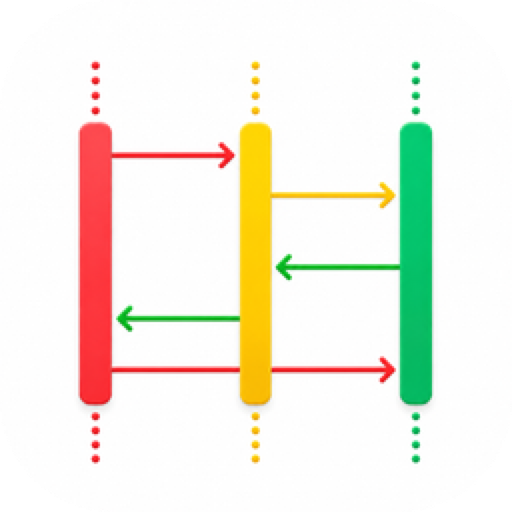
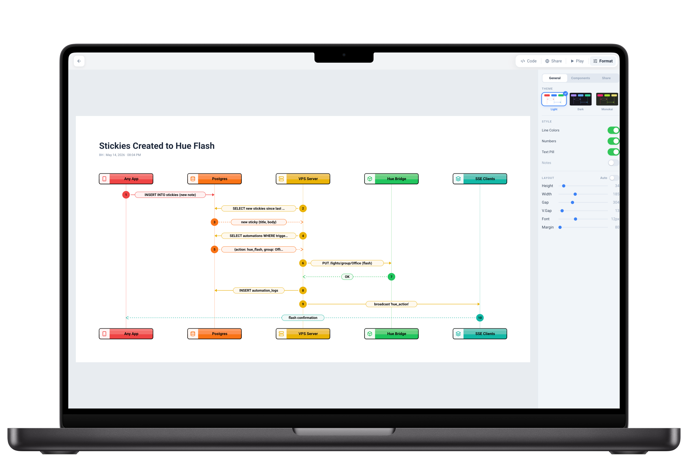

<div align="center">

#  Sequences

Sequence diagrams you can point at by step number. AI-friendly, AI-compatible, AI-driven, AI built in: an agent creates one over MCP or the API, any model writes the syntax for you to paste, and plain English generation ships inside. Every diagram renders to a crisp SVG you can drop into a README.

[](https://github.com/bunlongheng/sequences/actions/workflows/ci.yml)




**Live:** [sequences-bheng.vercel.app](https://sequences-bheng.vercel.app) &middot; **Demo wall:** [/demo](https://sequences-bheng.vercel.app/demo)

</div>

## Read this before you clone

This is a working app, not a library. It needs 3 things from you, and 1 more if you want the AI part.

| You provide | Why | Free option |
|---|---|---|
| **Postgres** | Every diagram lives here, no SQLite fallback | Neon, Supabase, Railway |
| **Google OAuth** | The only sign-in, 1 owner email | Google Cloud Console |
| **A host** | A Next.js server, not a static site | Vercel, or localhost |
| **Anthropic key** | Plain-English generation only | optional |

## 3 ways to get a diagram

**1. An agent makes it.** Over MCP or the POST API, so a coding agent, a script or a CI job writes straight into your library.

**2. Any AI writes the syntax.** Ask Gemini, ChatGPT or anything else for Mermaid `sequenceDiagram` code, then paste it anywhere on the page. It picks up the title, saves the diagram and opens it. No key, nothing to configure.

**3. curl the SVG into your docs.** 1 request returns a self-contained SVG for a README, Confluence or Notion page.

```bash
# create and get the markup back in 1 call
curl -s -X POST "$APP/api/ai/sequences?format=svg" \
  -H "Authorization: Bearer $SEQUENCES_API_SECRET" \
  -H "Content-Type: application/json" \
  -d '{"title":"Login","code":"sequenceDiagram\n  U->>A: Login\n  A-->>U: Token"}'

# or point at one that already exists
curl -s "$APP/svg/<id>" -o login.svg
```

In a README, the URL is the image: ``.

## Built for the meeting, not just the screenshot

- **Press Play and present it.** Fullscreen, then click any message to light it up while you talk. Numbered steps give the room one reference: "step 7", not "that arrow near the middle".
- **Every participant looks like what it is.** 26 icons, chosen from the label and never repeated inside a diagram, so a person, a browser, a database and a file are told apart at a glance. Override the icon, the label or the colour on any of them.
- **It lays itself out.** Auto layout reads the content and picks the row pitch, column widths and margins, so a 20-message diagram opens compact with nothing overlapping and no message cut off. 6 sliders are there when you disagree.
- **Looks finished.** 3 themes, 5 box treatments, coloured lifelines, message pills, and notes and step numbers you can switch off.
- **Share it in a click.** A link or a QR code to put it in front of your team for feedback, plus PNG, SVG, the Mermaid source, or the SVG straight onto your clipboard.

## Quick start

```bash
git clone https://github.com/bunlongheng/sequences.git
cd sequences
cp .env.local.example .env.local   # fill in DATABASE_URL, Google OAuth, OWNER_EMAIL
npm install
npm run migrate                    # applies db/migrations to a fresh database
npm run dev                        # http://localhost:3002
```

## Configuration

| Env var | Purpose |
|---|---|
| `DATABASE_URL`, `DATABASE_SSL` | Postgres connection. `DATABASE_SSL=true` for a remote host |
| `AUTH_SECRET` | NextAuth v5 secret. `openssl rand -base64 32` |
| `GOOGLE_CLIENT_ID`, `GOOGLE_CLIENT_SECRET` | Google OAuth. Redirect URI is `/api/auth/callback/google` |
| `OWNER_EMAIL`, `OWNER_USER_ID` | The 1 account that can sign in, and the id its rows are stored under |
| `SEQUENCES_API_SECRET` | Bearer for `POST /api/ai/sequences` and the MCP server |
| `ANTHROPIC_API_KEY` | Plain-English generation only. Leave unset to disable it |
| `NEXT_PUBLIC_APP_URL` | Absolute links in API responses and share pages |

## API

| Route | What |
|---|---|
| `POST /api/ai/sequences` | Create from `{title, code}`, Bearer auth |
| `GET /svg/<id>` | The SVG. `?title=0` drops the heading |
| `GET /s/<id>` | Share page with OG image |
| `GET /demo` | The public demo wall |

**MCP.** `mcp/server.mjs` exposes `create_sequence`, `list_sequences`, `get_sequence`, `update_sequence`, `delete_sequence` and `get_sequence_schema` over stdio. Register it with your agent and point `SEQUENCES_API_SECRET` at your deployment. See [mcp/README.md](mcp/README.md).

## Contributing

Issues and pull requests are welcome. Run `npm run lint`, `npm run test` and `npm run test:e2e` before opening one.

---

<div align="center">

<a href="https://bunlongheng.com"></a>
<a href="https://www.linkedin.com/in/bunlongheng/"></a>
<a href="https://www.instagram.com/ibunlong/"></a>
<a href="mailto:bheng.code@gmail.com"></a>

</div>
